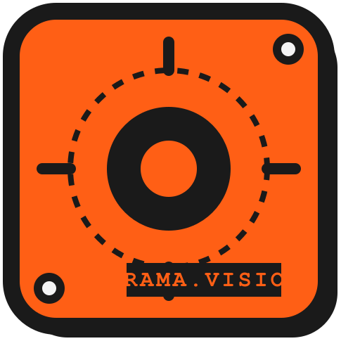

<div align="center">
  

  <h1>ORAMA.vision</h1>

  <p><strong>Modular Digital Image Processing Hub</strong> — 100% client-side, zero backend.</p>

  <p>A neobrutalism-themed web application for learning and experimenting with digital image processing techniques.<br/>Built with Next.js 16, React 19, TypeScript, and Tailwind CSS v4.</p>

  [](https://nextjs.org/)
  [](https://typescriptlang.org/)
  [](https://tailwindcss.com/)
  [](https://react.dev/)
  []()

</div>

---

## Table of Contents

1. [Overview](#overview)
2. [Key Features](#key-features)
3. [Modules](#modules)
   - [1. Steganography & Detection](#1-steganography--detection)
   - [2. Smart Agriculture AI](#2-smart-agriculture-ai)
   - [3. Document Scanner](#3-document-scanner)
   - [4. Enhancement Advisor](#4-enhancement-advisor)
   - [5. Image Forensics](#5-image-forensics)
   - [6. Histogram & Equalization](#6-histogram--equalization)
   - [7. Color Space Converter](#7-color-space-converter)
   - [8. Edge Detection](#8-edge-detection)
   - [9. Convolution Filters](#9-convolution-filters)
   - [10. Morphological Operations](#10-morphological-operations)
4. [Tech Stack](#tech-stack)
5. [Architecture](#architecture)
6. [Getting Started](#getting-started)
7. [Deployment](#deployment)
8. [Academic References](#academic-references)
9. [Author](#author)

---

## Overview

ORAMA.vision is a comprehensive, browser-based digital image processing platform designed for both educational and practical use. All processing is performed **client-side** using the HTML5 Canvas API and pure TypeScript — no images are ever uploaded to any server.

The application implements classical image processing algorithms from peer-reviewed literature, covering steganography, computer vision, image enhancement, forensic analysis, and mathematical morphology. Each module is fully self-contained with its own processing library, React hooks, and UI components.

---

## 🎨 UI & UX Highlights

- **Bilingual Support (i18n):** Real-time switching between English (EN) and Indonesian (ID)
- **Neo-Brutalism Design:** Bold typography, harsh shadows (`neo-shadow`), vibrant palettes (Dark Teal, Neon Orange, Bone)
- **Responsive Architecture:** Mobile-functional with collapsible category-based navigation
- **Smart Drag & Drop:** Load images via device picker, URL fetching, or 60+ shuffled sample images

---

## Key Features

| Feature | Description |
|---------|-------------|
| 🖥️ **100% Browser Processing** | All algorithms run on Canvas `ImageData` — fully offline-capable |
| 🧩 **10 Interactive Modules** | Steganography, vision, enhancement, forensics & image math |
| 🌐 **Bilingual UI** | English & Indonesian with runtime switching |
| 🖼️ **Sample Image Library** | 60+ curated images with random selection & URL loading |
| 💾 **Smart Downloads** | Output filenames follow `{feature}_{timestamp}.png` convention |
| 🎨 **Neobrutalism Design** | Dark Teal + Neon Orange theme with bold borders & shadows |
| 📱 **Responsive Layout** | Mobile-first with categorized dropdown navigation |
| 📦 **Feature-Driven Architecture** | Each module is isolated under `src/features/` |

---

## Modules

### 1. Steganography & Detection

**Route:** `/steganography`

Implements Least Significant Bit (LSB) steganography for hiding text messages within images, along with a chi-square steganalysis detector.

#### Encoding (LSB Embedding)

The encoder replaces the least significant bit of each RGB byte with one bit of the secret message. The alpha channel is untouched.

```
new_byte = (original_byte & 0xFE) | message_bit
```

Maximum embedding capacity:

$$C = \frac{W \times H \times 3}{8} - |\text{delimiter}|$$

where $W$ and $H$ are the image dimensions in pixels and each character requires 8 bits.

#### Decoding

The decoder reads the LSB of every RGB byte, reassembles 8-bit characters, and stops at the delimiter (`[END]`). If the delimiter is missing or corrupted, the result will contain noise.

#### Detection (Chi-Square Steganalysis)

LSB embedding tends to **equalize** the frequency counts of pixel-value pairs $(2v,\ 2v+1)$. The chi-square statistic measures this deviation:

$$\chi^2 = \sum_{v=0}^{127} \frac{(O_{2v} - E_v)^2 + (O_{2v+1} - E_v)^2}{E_v}, \quad E_v = \frac{O_{2v} + O_{2v+1}}{2}$$

The p-value is estimated via the normal approximation:

$$Z = \sqrt{2\chi^2} - \sqrt{2k - 1}$$

where $k$ is the degrees of freedom (valid pairs where $E_v \ge 5$). A **high p-value** (low chi-square) indicates suspiciously uniform pair distributions — a hallmark of LSB embedding. The implementation uses the *Abramowitz & Stegun* polynomial approximation for the normal CDF.

---

### 2. Smart Agriculture AI

**Route:** `/agriculture`

Provides two tools for agricultural image analysis: object counting via connected component labeling and circular object detection via the Hough Transform.

#### Object Counting (Connected Component Labeling)

1. **Grayscale conversion:** $Y = 0.299R + 0.587G + 0.114B$
2. **Binary thresholding** with user-configurable threshold mapping
3. **Two-pass CCL** with Union-Find (path compression) for equivalence resolution
4. **Area filtering** — noise components below `minArea` are discarded
5. **Bounding-box visualization** with per-object color overlay

#### Coin/Circle Detection (Hough Circle Transform)

Detects and counts circular objects (coins, fruits) and overlays detected radii.

1. **Sobel edge detection** produces a binary edge map from grayscale
2. **Hough accumulator voting** — for each edge pixel, candidate radius $r$, and sampled angle $\theta$:

$$a = x - r\cos\theta, \quad b = y - r\sin\theta$$

3. **Peak detection with NMS** localizes circle centers and prevents duplicate counts

---

### 3. Document Scanner

**Route:** `/document-scanner`

Simulates a mobile document scanner by finding paper edges and warping them flat.

#### Pipeline

**Step 1 — Gaussian Blur** (3×3 kernel to remove texture noise):

$$K_{gauss} = \frac{1}{16}\begin{pmatrix}1&2&1\\2&4&2\\1&2&1\end{pmatrix}$$

**Step 2 — Sobel Edge Detection** — computes 2D gradient magnitude:

$$G = \sqrt{G_x^2 + G_y^2}$$

**Step 3 — Otsu's Thresholding** — maximizes inter-class variance between foreground/background:

$$\sigma_B^2 = w_B \cdot w_F \cdot (\mu_B - \mu_F)^2$$

**Step 4 — Quadrant-based Corner Detection** — finds 4 extreme outermost edge points per image quadrant.

**Step 5 — Perspective Transform (Warp)** — 8-parameter projective homography solved via Gaussian elimination:

$$\begin{pmatrix}x'\\y'\end{pmatrix} = \frac{1}{h_7 x + h_8 y + 1}\begin{pmatrix}h_1 x + h_2 y + h_3\\h_4 x + h_5 y + h_6\end{pmatrix}$$

**Step 6 — Bilinear Interpolation** for smooth sub-pixel mapping:

$$f(x,y) = f_{00}(1-f_x)(1-f_y) + f_{10}f_x(1-f_y) + f_{01}(1-f_x)f_y + f_{11}f_xf_y$$

**Step 7 — Adaptive Thresholding** (optional B&W filter) — pixel becomes white if $I(x,y) > \mu_{\text{local}} - C$.

---

### 4. Enhancement Advisor

**Route:** `/enhancement`

Intelligent image quality analysis that evaluates multiple metrics and suggests optimal enhancements.

#### Image Quality Metrics

| Metric | Method |
|--------|--------|
| **Brightness** | Mean luminance: $\bar{L} = \frac{1}{N}\sum_{i=1}^{N} L_i$ |
| **Contrast** | Std. deviation of luminance: $\sigma_L = \sqrt{\frac{1}{N}\sum(L_i - \bar{L})^2}$ |
| **Saturation** | Mean HSL saturation across all pixels |
| **Sharpness** | Laplacian variance using kernel $[0,1,0;\ 1,-4,1;\ 0,1,0]$ |
| **Dominant Color** | Most frequent hue bucket in HSL space |

#### Enhancement Formulas

| Enhancement | Formula |
|------------|---------|
| **Brightness** | $O = \text{clamp}(I + \Delta b,\ 0,\ 255)$ |
| **Contrast** | $F = \frac{259(C+255)}{255(259-C)}$;   $O = F \cdot (I - 128) + 128$ |
| **Saturation** | $O = \text{gray} + (1 + s/100) \cdot (I - \text{gray})$ |
| **Sharpening** | Unsharp mask: $O = I - \alpha \cdot \nabla^2 I$ |

A rule-based engine evaluates each metric against configurable thresholds and generates prioritized suggestions with severity levels.

---

### 5. Image Forensics

**Route:** `/forensics`

Mini forensics toolkit for detecting image manipulation through four independent analysis techniques.

#### Error Level Analysis (ELA)

Re-compresses the image at reduced JPEG quality and measures per-pixel deviation:

$$D(x,y) = \frac{|R_{\text{orig}} - R_{\text{re}}| + |G_{\text{orig}} - G_{\text{re}}| + |B_{\text{orig}} - B_{\text{re}}|}{3}$$

The difference is amplified by a configurable scale factor and mapped to a green→yellow→red heatmap. High ELA residuals may indicate splicing or editing.

#### Blur & Sharpness Map

Divides the image into blocks and computes per-block Laplacian variance:

$$\text{Var}(B) = \frac{1}{n}\sum L_i^2 - \left(\frac{1}{n}\sum L_i\right)^2$$

Low-variance blocks → **red** (blurry). High-variance blocks → **blue** (sharp). Useful for detecting content-aware fill or selective blur.

#### Noise Pattern Analysis

Extracts the high-frequency residual via 3×3 mean subtraction:

$$R(x,y) = I(x,y) - \frac{1}{9}\sum_{(i,j) \in 3\times3} I(i,j)$$

Measures noise uniformity across four quadrants:

$$U = \frac{\min(q_1, q_2, q_3, q_4)}{\max(q_1, q_2, q_3, q_4)}$$

$U \approx 1$ → uniform noise (natural image). Low $U$ → different noise profiles, possible splicing.

#### EXIF Metadata Extraction

Lightweight JPEG APP1/EXIF parser supporting: camera make/model, exposure, ISO, focal length, datetime, GPS pointer, and image dimensions.

---

### 6. Histogram & Equalization

**Route:** `/histogram`

Visualize per-channel (R, G, B, Luminance) histograms and apply histogram equalization to boost contrast.

#### Histogram Computation

Builds 256-bin frequency distributions. Luminance is computed as:

$$L = 0.299R + 0.587G + 0.114B$$

#### Histogram Equalization

CDF-based mapping on the luminance channel:

$$h'(v) = \text{round}\!\left(\frac{CDF(v) - CDF_{\min}}{N - CDF_{\min}} \times 255\right)$$

Color hue is preserved by proportional channel scaling:

$$O_c = I_c \times \frac{L_{\text{new}}}{L_{\text{old}}}$$

This prevents color shift while equalizing the brightness distribution.

---

### 7. Color Space Converter

**Route:** `/color-space`

Convert images between 10 different color representations.

| Mode | Description |
|------|-------------|
| **Grayscale** | ITU-R BT.601: $Y = 0.299R + 0.587G + 0.114B$ |
| **Sepia** | Linear RGB matrix transform |
| **Binary** | Threshold: $O = (L > T)\ ?\ 255 : 0$ |
| **Inverted** | Negative: $O_c = 255 - I_c$ |
| **Red / Green / Blue** | Channel isolation (other channels zeroed) |
| **Hue Map** | HSL hue → visible spectrum color |
| **Saturation Map** | HSL saturation → grayscale |
| **Brightness Map** | HSL lightness → grayscale |

The sepia matrix:

$$M_{sepia} = \begin{pmatrix}0.393 & 0.769 & 0.189\\0.349 & 0.686 & 0.168\\0.272 & 0.534 & 0.131\end{pmatrix}$$

#### RGB → HSL Conversion

$$L = \frac{\max(R,G,B) + \min(R,G,B)}{2}$$

$$S = \begin{cases}\dfrac{d}{\max + \min} & L \le 0.5 \\[6pt] \dfrac{d}{2 - \max - \min} & L > 0.5\end{cases}$$

$$H = \begin{cases}60°\times\dfrac{G-B}{d} & \text{if max} = R \\[6pt] 60°\times\!\left(\dfrac{B-R}{d}+2\right) & \text{if max} = G \\[6pt] 60°\times\!\left(\dfrac{R-G}{d}+4\right) & \text{if max} = B\end{cases}$$

---

### 8. Edge Detection

**Route:** `/edge-detection`

Detect edges using four classical gradient-based operators. All methods convert to grayscale, apply convolution kernels, and compute gradient magnitude.

#### Sobel Operator

$$G_x = \begin{pmatrix}-1&0&1\\-2&0&2\\-1&0&1\end{pmatrix}, \quad G_y = \begin{pmatrix}-1&-2&-1\\0&0&0\\1&2&1\end{pmatrix}, \quad G = \sqrt{G_x^2 + G_y^2}$$

#### Prewitt Operator

$$G_x = \begin{pmatrix}-1&0&1\\-1&0&1\\-1&0&1\end{pmatrix}, \quad G_y = \begin{pmatrix}-1&-1&-1\\0&0&0\\1&1&1\end{pmatrix}, \quad G = \sqrt{G_x^2 + G_y^2}$$

#### Laplacian Operator

$$K = \begin{pmatrix}0&1&0\\1&-4&1\\0&1&0\end{pmatrix}, \quad G = |K * I|$$

#### Roberts Cross Operator

$$G_x = \begin{pmatrix}1&0\\0&-1\end{pmatrix}, \quad G_y = \begin{pmatrix}0&1\\-1&0\end{pmatrix}, \quad G = \sqrt{G_x^2 + G_y^2}$$

Optional **inversion** toggles output polarity (white edges on black ↔ black edges on white).

---

### 9. Convolution Filters

**Route:** `/filters`

Apply spatial convolution filters using arbitrary 3×3 kernels with configurable iterations.

#### Convolution Formula

$$O(x,y) = \frac{1}{D}\sum_{i=-1}^{1}\sum_{j=-1}^{1} I(x+i,\, y+j) \cdot K(i,j)$$

where $D = \max\!\left(1,\, \sum_{i,j} K_{i,j}\right)$ prevents brightness shift. Output is clamped to $[0, 255]$.

#### Preset Kernels

| Preset | Kernel | Effect |
|--------|--------|--------|
| **Identity** | $\text{diag}[0,1,0]$ center = 1 | No change |
| **Box Blur** | All ones, divide by 9 | Uniform averaging |
| **Gaussian Blur** | Weighted $[1,2,1]$ pattern, divide by 16 | Smooth blur |
| **Sharpen** | Center = 5, cardinal neighbors = -1 | High-frequency boost |
| **Unsharp Mask** | All -1, center = 9 | Strong sharpening |
| **Emboss** | Diagonal gradient $[-2,-1,0;-1,1,1;0,1,2]$ | 3D relief effect |
| **Edge Enhance** | $[-1,1,0]$ horizontal | Horizontal edge boost |

Users can define **custom 3×3 kernels** with live preview, and apply multiple iterations for stronger effects.

---

### 10. Morphological Operations

**Route:** `/morphology`

Binary morphological operations with configurable structuring elements. Input images are auto-binarized before processing.

#### Operations

| Operation | Definition | Purpose |
|-----------|-----------|---------|
| **Erosion** | $\varepsilon_B(f)(x) = \min_{b \in B} f(x+b)$ | Shrink bright regions |
| **Dilation** | $\delta_B(f)(x) = \max_{b \in B} f(x+b)$ | Expand bright regions |
| **Opening** | $\gamma_B = \delta_B \circ \varepsilon_B$ | Remove small bright objects |
| **Closing** | $\varphi_B = \varepsilon_B \circ \delta_B$ | Fill small dark holes |
| **Gradient** | $\nabla_B = \delta_B(f) - \varepsilon_B(f)$ | Extract object edges |
| **Top Hat** | $\hat{T}_B = f - \gamma_B(f)$ | Isolate bright fine detail |
| **Black Hat** | $\hat{B}_B = \varphi_B(f) - f$ | Isolate dark fine detail |

#### Structuring Element Shapes

| Shape | Definition |
|-------|-----------|
| **Square** | All pixels in $k \times k$ window |
| **Cross (+)** | Center row + center column only |
| **Circle** | All $(dx,dy)$ where $dx^2 + dy^2 \le r^2$ |

---

## Tech Stack

| Technology | Version | Usage |
|-----------|---------|-------|
| **Next.js** | 16.1.6 | App Router, Static Generation, React 19 |
| **TypeScript** | 5.x | Strict type-safety across all modules |
| **Tailwind CSS** | v4 | Neobrutalism utility classes via `@theme inline` |
| **React** | 19.2.3 | UI components, hooks, context |
| **Canvas API** | Native | All image I/O and pixel-level processing |
| **PostCSS** | — | Via `@tailwindcss/postcss` plugin |

> ⚠️ **Zero external image processing libraries.** No OpenCV, no Sharp, no Jimp. Every algorithm is implemented from scratch in TypeScript.

---

## Architecture

```
src/
├── app/                              # Next.js App Router pages
│   ├── page.tsx                      # Landing page (module cards)
│   ├── layout.tsx                    # Root <html> with LanguageProvider
│   ├── globals.css                   # Theme tokens + neo-* utility classes
│   ├── steganography/page.tsx
│   ├── agriculture/page.tsx
│   ├── document-scanner/page.tsx
│   ├── enhancement/page.tsx
│   ├── forensics/page.tsx
│   ├── histogram/page.tsx
│   ├── color-space/page.tsx
│   ├── edge-detection/page.tsx
│   ├── filters/page.tsx
│   └── morphology/page.tsx
│
├── features/                         # Feature modules (domain-driven)
│   ├── steganography/
│   │   ├── lib/lsb.ts               # LSB encode/decode, chi-square detection
│   │   ├── hooks/useSteganography.ts
│   │   └── ui/SteganographyPanels.tsx
│   ├── agriculture/
│   │   ├── lib/counter.ts           # CCL, Hough circle transform
│   │   ├── hooks/useDetection.ts
│   │   └── ui/AgriculturePanels.tsx
│   ├── document-scanner/
│   │   ├── lib/scanner.ts           # Homography, Otsu, adaptive threshold
│   │   ├── hooks/useScanner.ts
│   │   └── ui/ScannerPanel.tsx
│   ├── enhancement/
│   │   ├── lib/advisor.ts           # Metrics analysis, enhancement engine
│   │   ├── hooks/useEnhancement.ts
│   │   └── ui/EnhancementPanel.tsx
│   ├── forensics/
│   │   ├── lib/forensics.ts         # ELA, blur map, noise, EXIF
│   │   ├── hooks/useForensics.ts
│   │   └── ui/ForensicsPanel.tsx
│   ├── histogram/
│   │   ├── lib/histogram.ts         # Histogram compute, equalize, draw
│   │   ├── hooks/useHistogram.ts
│   │   └── ui/HistogramPanel.tsx
│   ├── color-space/
│   │   ├── lib/colorSpace.ts        # RGB↔HSL, 10 conversion modes
│   │   ├── hooks/useColorSpace.ts
│   │   └── ui/ColorSpacePanel.tsx
│   ├── edge-detection/
│   │   ├── lib/edgeDetect.ts        # Sobel, Prewitt, Laplacian, Roberts
│   │   ├── hooks/useEdgeDetection.ts
│   │   └── ui/EdgeDetectionPanel.tsx
│   ├── filters/
│   │   ├── lib/filters.ts           # 2D convolution, 7 preset kernels
│   │   ├── hooks/useFilters.ts
│   │   └── ui/FiltersPanel.tsx
│   └── morphology/
│       ├── lib/morphology.ts        # 7 morph ops, 3 SE shapes
│       ├── hooks/useMorphology.ts
│       └── ui/MorphologyPanel.tsx
│
└── shared/
    ├── components/
    │   ├── Navbar.tsx               # Categorized dropdown nav (10 modules)
    │   ├── Footer.tsx               # Credits & copyright
    │   ├── FileUpload.tsx           # Drag & drop + URL input + 60 samples
    │   ├── PageHeader.tsx           # Reusable page title hero
    │   └── ResultDisplay.tsx        # Status indicator + download button
    └── i18n/
        ├── LanguageContext.tsx       # React context + useTranslation hook
        └── locales/
            ├── en.ts                # English translations (350+ keys)
            └── id.ts                # Indonesian translations
```

### Design Principles

| Principle | Description |
|-----------|-------------|
| **Feature-Driven** | Each module owns its `lib/`, `hooks/`, and `ui/` — no cross-module dependencies |
| **Pure Functions** | Processing libraries are stateless: `ImageData` in, results out. No side effects |
| **Hooks as Controllers** | React hooks bridge the UI and lib layers, managing async state & Canvas I/O |
| **Shared UI Layer** | `FileUpload`, `ResultDisplay`, `PageHeader`, `Navbar` ensure visual consistency |

---

## Getting Started

```bash
# Clone the repository
git clone <repo-url>
cd orama

# Install dependencies
npm install

# Start development server
npm run dev

# Build for production
npm run build
```

Open [http://localhost:3000](http://localhost:3000) in your browser.

### System Requirements

- **Node.js** 18+ (LTS recommended)
- **Browser:** Any modern browser with Canvas API support (Chrome, Firefox, Edge, Safari)
- No GPU required — all processing is CPU-based

---

## Deployment

Deploy instantly on [Vercel](https://vercel.com):

[](https://vercel.com/new)

A `vercel.json` is included with optimal configuration. All 12 routes are statically pre-rendered at build time.

---

## Academic References

The algorithms implemented in this project are based on the following foundational works:

1. **Gonzalez, R.C. & Woods, R.E.** (2018). *Digital Image Processing*, 4th ed. Pearson. — Histogram equalization, spatial filtering, morphological operations, edge detection.
2. **Otsu, N.** (1979). "A threshold selection method from gray-level histograms." *IEEE Trans. SMC*, 9(1), 62–66. — Otsu's thresholding.
3. **Westfeld, A. & Pfitzmann, A.** (2000). "Attacks on Steganographic Systems." *Information Hiding*, LNCS 1768, 61–76. — Chi-square steganalysis.
4. **Krawetz, N.** (2007). "A Picture's Worth… Digital Image Analysis and Forensics." *Black Hat Briefings*. — Error Level Analysis.
5. **Duda, R.O. & Hart, P.E.** (1972). "Use of the Hough transformation to detect lines and curves in pictures." *Commun. ACM*, 15(1), 11–15. — Hough Transform.
6. **Haralick, R.M., Sternberg, S.R. & Zhuang, X.** (1987). "Image Analysis Using Mathematical Morphology." *IEEE TPAMI*, 9(4), 532–550. — Mathematical morphology.
7. **Sobel, I.** (1968). "An Isotropic 3×3 Image Gradient Operator." *Stanford AI Project*. — Sobel operator.
8. **Prewitt, J.M.S.** (1970). "Object Enhancement and Extraction." *Picture Processing and Psychopictorics*. — Prewitt operator.
9. **Roberts, L.G.** (1963). "Machine Perception of Three-Dimensional Solids." *MIT Lincoln Lab*. — Roberts Cross operator.
10. **Hartley, R. & Zisserman, A.** (2004). *Multiple View Geometry in Computer Vision*, 2nd ed. Cambridge. — Projective homography.

---

<div align="center">

**FIRDAUS SATRIO UTOMO**

*Digital Image Processing — © 2026*

</div>